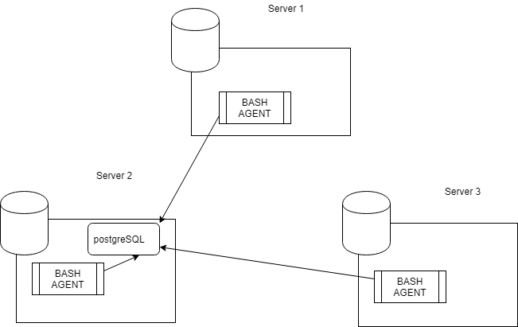

# INTRODUCTION

A cluster management tool is a software program that helps you manage a group of clusters through a graphical user interface or by accessing a command line. With this tool, you can monitor nodes in the cluster, configure services and administer the entire cluster server. Cluster management can vary from low-involvement activities such as sending work to a cluster to high-involvement work such as load-balancing and availability. 

Clearly, containers are an exciting new advancement in creating and delivering applications. However, controlling a vast deployment of containers presents some complications. Containers must be matched with resources. Failures have to be resolved quickly. These challenges have led to a concurrent demand for cluster management and orchestration tools.

# ARCHITECTURE AND DESIGN

2-- In this we created one database 'host_agent' and two tables named 'host_info' which stores hardware specification information and other table 'host_usage' which stores CPU and memory data .
3-- We created two scripts named 'host_info.sh'which collects host hardware info  and stores it in table created named 'host_info' and other script'host_usage' collects CPU and memory data and stores it in table 'host_usage' .We also created init.sql file to create databse and its correspondings tables

# USAGE
- Creating databse 
 `CREATE DATABASE host_agent;`

- Creating tables
`CREATE TABLE  PUBLIC.host_usage(timestamp TIMESTAMP NOT NULL,host_id SERIAL NOT NULL, free_mem INT4 NOT NULL, cpu_idel INT2 NOT NULL, cpu_kernel INT2 NOT NULL, disk_io INT4  NOT NULL, disk_avail INT4  NOT NULL, CONSTRAINT host_usage_host_info_fk FOREIGN KEY(host_id) REFERENCES host_info(id));`

- In host_info.sh we are first initialising the variables that are going to use to make connection with postgreSQL. Then by making use of various commands like hostname and lscpu we are taking values for the variables that are going to be value of the fields in the host_info table

- In host_usage.sh we are first initialising the variables that are going to use to make connection with postgreSQL. Then by making use of various commands like vmstat and df we are taking values for the variables that are going to be value of the fields in the host_info table

# IMPROVEMENTS
- we can implement fail-over cluster incase one goes down we can continue functioning with the other one
- hardware updates

